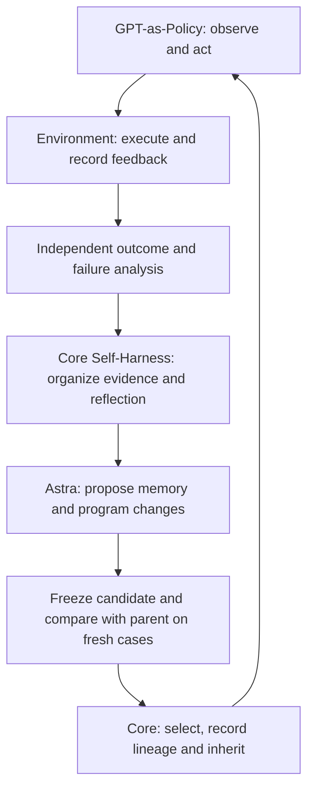

# Dexterous manipulation research — work in progress

This is a research proposal for dual-arm, multi-finger manipulation with
GPT-as-Policy and PhysicalRSI Core. It documents the approach and the next
experiments. This directory currently contains documentation only; a runnable
demo and successful manipulation results are not part of this contribution.

## Research direction

We study how an acting agent can improve its memory, analysis tools and control
programs from execution feedback. The initial tasks are **camera handling** and
**peg insertion**. Both require object acquisition, sustained grasp, coordinated
motion and precise contact. The intended hardware target is Tianji arms with
BrainCo hands, following validation in simulation.

The approach connects [GPT-as-Policy](https://github.com/anonymous-report-421/GPT-as-Policy)
to [PhysicalRSI Core](../../PhysicalRSI_core/README.md). GPT-as-Policy supplies
the acting agent: `CodexPolicy`, a persistent Codex app-server session, image
and shell tools, and working memory. The environment adapter supplies images,
measured robot state, bounded actions and execution feedback.

PhysicalRSI Core organizes the complete improvement loop: development
experiments, evidence collection, proposals, candidate evaluation, selection
and version inheritance. Astra proposes changes to memory and helper programs;
its foundation-model weights remain fixed.

System 1 acts within an episode. System 2 revises and evaluates the resources
used by subsequent episodes. Rejected proposals and contradictory evidence
remain available for later analysis; a failed comparison retains the parent.

## Current status

As of 2026-10-09, local simulation experiments have exercised the experiment,
reflection, paired-evaluation and inheritance workflow. A generated geometry
helper was loaded and invoked during a candidate rollout. **The completed
comparisons have no successful camera-handling or insertion trials and have
not demonstrated an improvement in task success.** These are online-agent
research experiments, not an official native-policy benchmark score.

The insertion rollout exposed an earlier failure: the left hand did not lift
the tray from its support. Wrist motion and smaller alignment errors did not
establish a successful grasp. Acquisition and retention therefore need explicit
evidence before the agent proceeds to alignment or insertion.

The current development backend uses native DexJoCo Assembly and Photograph
tasks with Panda arms and Allegro hands. No Tianji/BrainCo hardware experiment
has been completed. The research scope is dexterous manipulation; the simulator
is the present environment for investigating it.

## Next experiments

1. **Verify acquisition and retention.** Use fresh views to establish that each
   object leaves its support and follows the intended hand through a small
   motion. Record ambiguous or failed pickup attempts and test bounded regrasp.
2. **Diagnose the earliest missed stage.** For insertion, separate pickup,
   retention, alignment, insertion and stabilization. For camera handling,
   separate pickup, retention, viewing pose and shutter actuation. A later
   substep cannot substitute for an unmet earlier requirement.
3. **Close the learning loop with evidence.** Give reflection the recorded
   observations, actions, working programs and verified outcomes. Freeze the
   resulting memory/program candidate before comparing it with its parent on
   fresh, matched initial conditions. Verify the selected artifacts are actually
   loaded in the next round.
4. **Measure task success and regressions.** Precommit case splits, budgets and
   selection rules. Keep final cases sealed, preserve failures, and report the
   original environment outcome alongside stage evidence. Simulator-assisted
   post-episode diagnostics are additional research feedback, not live sensors.
5. **Prepare hardware transfer after simulation validation.** Confirm the exact
   devices and SDK/ROS interfaces; calibrate cameras, frames, TCPs and hand
   commands; implement measured feedback and independent outcome checks.
   Simulation action arrays and model-paused timing require new device-side
   control and validation before physical experiments.

Runtime code and recorded evidence are being organized locally. A later code
contribution should include reproducible setup, pinned dependencies, tests and
an explicit account of what succeeds and what still fails. This proposal makes
no claim of a completed manipulation demo or hardware-ready policy.
