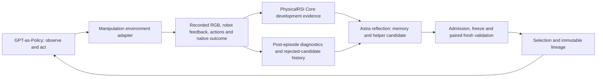

# Dexterous Manipulation Research — Work in Progress

This research track studies closed-loop manipulation with two arms and
multi-finger hands: acquiring and retaining objects, coordinating the hands,
making precise contact, and revising memory and control programs from execution
feedback. Current experiments cover camera handling and peg insertion in
simulation. The intended hardware target is Tianji arms with BrainCo hands.

GPT-as-Policy supplies the acting agent; PhysicalRSI Core organizes the
improvement loop. The adapter preserves the upstream `CodexPolicy`, persistent
Codex app-server session, image tools, shell and working memory. Environment
observations, actions and verification are supplied through explicit adapters.
Hardware migration is planned; it has not been demonstrated.

**Status: in progress; neither camera handling nor insertion has succeeded in
the completed comparisons.** The experiment loop has run. Completed
comparisons have retained the parent. A generated geometry helper was frozen,
loaded and actually invoked during a candidate rollout, but neither task
succeeded in that paired comparison. The Assembly candidate also failed to lift
the tray with its left hand. See [the research record](docs/research_status.md).
This is an online agent research track, not an official native-policy benchmark
score or a hardware qualification.

Software tests establish interface, evidence and inheritance behavior. They do
not establish manipulation success or improvement. This export is organized
from the executed research snapshot; its packaging and protocol tests are
separate from the historical task outcomes reported below.



System 1 executes the task. System 2 includes development, reflection, admission,
freezing, evaluation, selection, research-memory retrieval and inheritance.
Astra proposes memory/program changes; Core organizes and records the process.
The model's weights are not changed.

This research code lives at `PhysicalRSI_demos/dexterous_manipulation/` and is
installed with the repository's `dexterous` extra. Its simulation command is
`physicalrsi-dexterous-loop`. The repository's existing `/demo dexjoco`
workflow retains its own entry point and workspaces. See
[the integration boundaries](docs/architecture.md#relationship-to-existing-workflows)
and [the hardware migration plan](docs/hardware_migration.md).

## What is included

- The simulation adapter and feedback loop from the running
  `learning-feedback-loop-01` snapshot, extracted from the standalone project
  with repository packaging and focused integration tests.
- A small reviewed patch to GPT-as-Policy's runtime injection points.
- Working-program feedback, independent native verdicts, post-episode replay
  diagnostics, failed-candidate history and actual next-round load checks.
- The separate left-grasp review script used to check the reported failure.
- A hardware migration plan. ROS drivers, device gateways and incomplete
  hardware configurations remain outside this contribution.

Core is imported from this repository. GPT-as-Policy is prepared externally at
the commit in [provenance.json](provenance.json); neither dependency is copied
into this research package. Generated workspaces, credentials, model state,
simulator assets and videos are not source files for this contribution.

## Prepare the software

Use Python 3.11 and a separate environment. From the PhysicalRSI repository root:

```bash
python -m venv /tmp/physicalrsi-gpt-policy-venv
source /tmp/physicalrsi-gpt-policy-venv/bin/activate
python -m pip install -e '.[test,dexterous]'

export GPT_POLICY_RUNTIME=/tmp/physicalrsi-gpt-policy-runtime
python PhysicalRSI_demos/dexterous_manipulation/scripts/prepare_runtime.py \
  --destination "$GPT_POLICY_RUNTIME"
export PYTHONPATH="$GPT_POLICY_RUNTIME${PYTHONPATH:+:$PYTHONPATH}"

python -m pytest -q PhysicalRSI_demos/dexterous_manipulation/tests
```

The preparation script requires a new destination, checks out a pinned commit,
applies the recorded patch, and checks every recorded runtime source hash. It
accepts `--source /path/to/existing/GPT-as-Policy` for an offline local clone.
The software tests use protocol fixtures. Native simulator checks skip
until `DEXJOCO_SOURCE` names a compatible checkout.

## Run the current simulation backend

The currently implemented simulation backend is native DexJoCo Assembly and
Photograph. This backend name identifies the experimental setup, not the scope
of the research track. Its source/assets and dependencies must be supplied separately.
The recorded experiments used MuJoCo 3.4.0, native Panda/Allegro tasks, EGL
rendering, Codex CLI 0.153.2 and the configured `gpt-6-astra` endpoint. A working,
authenticated Codex app-server installation and model access are prerequisites;
they are not provided by this package. The upstream release recorded a different
CLI patch version, 0.153.4.

Use the Python environment that can run those native DexJoCo tasks, install this
repository with `python -m pip install -e '.[dexterous,dexterous-sim]'`, and retain
`GPT_POLICY_RUNTIME` on `PYTHONPATH`. The extras supply the adapter dependencies;
the compatible simulator checkout supplies its remaining native dependencies
and assets. Set the graphics configuration required by that host.

```bash
export DEXJOCO_SOURCE=/path/to/compatible/dexjoco
export MUJOCO_GL=egl
export EGL_PLATFORM=surfaceless

physicalrsi-dexterous-loop \
  --source "$DEXJOCO_SOURCE" \
  --output /path/to/new/experiment-workspace \
  --tasks bimanual_assembly bimanual_photograph --rounds 2 \
  --max-actions 1500 --physics-steps 1500 --seconds 7200 --agent-timeout 240 \
  --development-seed 7103 --validation-seed 7203 --test-seed 7303 \
  --seed-stride 1000
```

These are the recorded campaign's seed parameters. For a new research campaign,
choose and freeze fresh disjoint cases before inspecting outcomes. Seeds 0, 1
and 2 are sealed. Optional `--history-round /path/to/completed/round` arguments
import completed non-final history with evidence checks; imported cases may not
overlap the new schedule. Historical validation then becomes development
knowledge and must not be described as fresh validation. Test cases are
registered but not executed by this development loop.

The native horizons remain 1500 controls for Assembly and 1000 for Photograph.
Each control advances 20 ms. Simulation pauses while the model reasons: a
30-second rollout can take tens of minutes of wall time. This timing does not
establish suitability for continuous real-time robot control.

## Inspect a run

- `campaign.json`, `result.json` and `loaded_rounds.json` record campaign status,
  survivor lineage and actual runtime loading. The latter two appear on completion.
- `rounds/round-*/selection.json` records completed selection decisions.
- Trial `receipt.json` files distinguish completed outcomes from interruptions.
- `reflection_input.json` contains the bounded development feedback and pinned
  ResearchMemory revision used for that proposal.
- Each live episode's `galbot/loaded_candidate.json` binds loaded memory/program
  bytes; public `agent_events.jsonl` records actual shell helper invocation.
- `rollout.mp4` and `video_manifest.json` hold continuous native-control video,
  not a slideshow of agent observations.

The recorded grasp review can be repeated on a completed non-final Assembly trial:

```bash
python PhysicalRSI_demos/dexterous_manipulation/scripts/review_assembly_grasp.py \
  --trajectory /path/to/completed/trial/trajectory.json \
  --source "$DEXJOCO_SOURCE" \
  --output /path/to/new/left-grasp-review.json
```

It replays the recorded actions and verifies every public state checkpoint and
native terminal flag before reporting simulator-assisted grasp evidence. It does
not run an actor or change the native verdict. The original success predicate
does not enforce left-tray pickup; this distinction is essential for judging the
requested bimanual task. This separate review was not retroactively injected
into the frozen running campaign.

[Architecture and boundaries](docs/architecture.md) ·
[Results and current failure](docs/research_status.md) ·
[Simulation-to-hardware migration](docs/hardware_migration.md)
