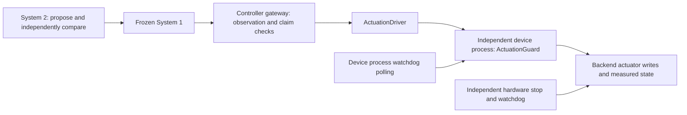

# Independent actuation and watchdog boundary

`ActuationGuard` places a second, authoritative ownership check immediately before actuator writes. `ActuationDriver` lets the existing controller gateway use that backend instead of holding a raw actuator handle. The device service continues polling independently when a controller process blocks or dies. Multiple controller processes using this one backend cannot bypass its current generation by creating different gateway workspaces.

This extends the separation of worker availability, execution and recovery studied in [OpenRSI's pinned dispatcher](https://github.com/FrontisAI/OpenRSI/blob/71ae803a035d5e3b78c19fa49ed9f67d0550cbaa/OpenMLE-Gym/openmle-sandbox/node_controller/task_dispatcher/task_dispatcher.py). Robot control also needs device-side liveness: [Spot's E-Stop service](https://dev.bostondynamics.com/docs/concepts/estop_service.html) checks endpoint heartbeats, and [Universal Robots' ReverseInterface](https://docs.universal-robots.com/Universal_Robots_ROS2_Documentation/doc/ur_client_library/doc/architecture/reverse_interface.html) carries a receive timeout with motion commands. These are design references; no vendor SDK, robot driver or upstream implementation is included in this module.

## Where each responsibility lives



| Boundary | Responsibility |
| --- | --- |
| System 1 | Produce bounded observation-based action chunks for its frozen revision |
| System 2 | Change candidates between trials; preserve the independently configured execution and verification conditions |
| Controller gateway | Enforce the client claim, observation reference, action contract and command deadline |
| Actuation backend | Enforce one shared device generation, System 1 attribution, action limits, scheduling and output inhibition |
| Backend quiescence check | Measure whether motion has settled after output is inhibited |
| Physical device integration | Enforce SDK exclusivity, hardware liveness, the actual stop mode and sensor validity even if the device process or host fails |

The controller claim and backend claim have separate authority IDs and generations. They are not interchangeable. A gateway's claim cannot directly authorize a backend write. The adapter acquires the backend's own claim during reset, renews before a bounded command, and releases after measured quiescence. There is no background renewal that keeps an abandoned controller alive.

## Backend contract

An actuator backend implements these bounded, serialized methods:

| Method | Meaning |
| --- | --- |
| `identity()` | Stable executable/configuration identity, including stop behavior and sensor dependencies |
| `validate(actions)` | Check every action, including dimensions, units and device limits, without effects |
| `reset(case)` | Establish the declared initial state while respecting the device stop/ownership contract |
| `observe()` | Return a fresh `SensorSample` captured in the declared local clock domain |
| `apply(action)` | Apply one already validated setpoint through the exclusive actuator path |
| `stop()` | Inhibit commanded output using the device-specific stop mode |
| `quiescence()` | Return `quiescent: bool` with measured stop evidence; command acknowledgment is insufficient |
| `tick(elapsed_seconds)` | Service bounded device I/O or advance a simulator, without renewing ownership |

The supplied backend is continuous native MuJoCo dynamics. Its stop sets its motor effort to zero and its declared passive damping brings velocity below a measured threshold. Zero effort is a property of these fixtures, not a portable robot stop command. A real arm, mobile base or gripper must implement its own stop mode and verification. Backend calls must be bounded; reset must not hide an unmonitored motion or an unbounded blocking SDK operation.

By default the reference RPC transport requires the same Linux boot and time namespace for controller and backend. An explicit `ClockSyncPolicy` enables [bounded conversion between declared clock domains](clock-domains.md), preserving capture uncertainty and conservatively translating deadlines. Clocks from different hosts are not silently compared. The implementation has software and native evidence with injected clock offsets on one host; actual multi-host clock bounds remain to be qualified. The included services bind localhost and can opt into [mutual TLS with method grants](control-transport-security.md). Bearer coordination claims remain separate from transport authentication and deployment isolation.

## Command and ownership semantics

`ActuationLimits` fixes lease duration, maximum command duration, maximum action count and the allowed polling gap. The backend rechecks the complete action list even when a controller already validated it. A command's whole horizon must fit its absolute deadline and the current backend lease. Synchronous admission work cannot extend that deadline. A queued request is checked against its request deadline before dispatch.

Accepted submission means the backend recorded and admitted a command; it does not mean the motion finished. `commands/<id>.json` begins as `started`. The device process applies the sequence on its own polling clock, then inhibits output. Only a fully applied sequence finishing within its timing constraints becomes `completed`. Missing ticks, expiry, late polling or an actuator error interrupt the command and quarantine ownership. Missed actions are never played in a catch-up burst. Replaying an accepted submission returns its saved acknowledgment without writing the actuator again; inspect the separate command status for execution outcome.

`stop()` inhibits output before further evidence I/O. That operation can leave velocity nonzero. `release()` requires a fresh positive quiescence measurement, persists it in `quiescence/<request-id>.json` before handoff, and returns that exact measurement with the authority's evidence digest. Failure to persist it retains ownership. The complete ownership generation remains unavailable until release. Expiry never grants automatic takeover. A stale generation cannot reset, write, stop or release a replacement owner's device.

Requests and their public inputs are durable. `intents/` contains actions, deadlines and credential digests; plaintext credentials are absent from intent files, public status and experiment evidence. Unknown writes are not replayed. If an actuator write takes effect and then raises an error, the guard requests a stop, records interruption and retains ownership for reconciliation. A stopped output does not turn an uncertain trial into a successful or failed task evaluation.

## Run the native process-death demonstration

```bash
pip install -e '.[mujoco]'
python -m PhysicalRSI_demos.mujoco_watchdog \
  --workspace "$(mktemp -d /tmp/physicalrsi-watchdog-slider.XXXXXX)" \
  --model slider

python -m PhysicalRSI_demos.mujoco_watchdog \
  --workspace "$(mktemp -d /tmp/physicalrsi-watchdog-hinge.XXXXXX)" \
  --model hinge
```

Each run starts separate actuator and controller processes. The actuator continuously advances MuJoCo, including while no RPC is in progress. The demonstration observes nonzero effort and motion, kills only the owned controller with `SIGKILL`, and inspects the surviving actuator. The finite command horizon inhibits output; simulation time continues advancing while measured velocity settles. The backend lease later expires without any renewal, and a new controller is denied ownership pending recovery.

The result records the observed motion, inhibited effort, measured speed, continuing simulation clock, backend survival and ownership rejection. The interrupted controller request remains `started`; the report keeps `trial_outcome: uncertain` and `qualification: null`. A fresh workspace is required even after an interrupted demonstration. The command never kills an unrelated process.

The native models have a declared passive damping value of 5 and a settling speed threshold of 0.02 in the corresponding joint units. Model, damping, source and backend identities are pinned. The simulator bounds catch-up work after a delayed poll, so omitted wall time is not presented as simulated dynamics.

## Recovery and service integration

The owning controller normally calls bounded `quiesce()`. The adapter inhibits output, waits for measured settling, releases the backend claim and only then allows the gateway claim to be released. The normal experiment test uses the existing `ExperimentRuntime`, frozen System 1, independent verifier and local `DeviceRegistry` through this path. A completed actuator pulse still fails a target-reaching task when the verifier observes insufficient movement.

If the controller died and lost its credential, the device-host application can invoke the local operator API on its existing guard object:

```python
import uuid

def recover_actuator(guard, *, operator, reason, inspection_evidence):
    snapshot = guard.inspect()
    return guard.recover(
        uuid.uuid4().hex,
        generation=snapshot["ownership"]["generation"],
        operator=operator,
        reason=reason,
        evidence=inspection_evidence,
    )
```

This fences the exact generation, inhibits output and verifies settling before release. If motion has not settled, the attempt requires reconciliation; inspect the device and use an explicitly new recovery attempt when justified. Completed recovery receipts replay without another stop. A new request for an obsolete generation cannot stop a replacement owner. Recovery shares the request-identity namespace, so an operator request cannot reuse an unrelated acquisition or motion ID.

`recover` is absent from the ordinary actuation RPC methods. Hosts can opt into the [local operator interface](operator-recovery.md), which authenticates the service UID through a private Unix socket and exposes `./physicalrsi operator inspect/prepare/recover/status`. It binds recovery to a saved inspection and exact generation; an unknown result cannot be retried automatically. After backend recovery, the interrupted gateway and experiment's local device claim also need their own reconciliation. None of these releases rewrite the trial outcome or its evidence.

Add `--recover-after-fault` to the native demonstration to explicitly exercise backend recovery, restart and recovery of the killed gateway, and a fresh bounded session. The original uncertain report remains in `result.json`; separate recovery artifacts and `recovery-result.json` record the subsequent operations.

## What has been verified

```bash
python -m pytest -q tests/test_actuation.py
python -m pytest -q tests/test_mujoco_watchdog.py
```

The software tests exercise finite sequence completion, independent settling, missed ticks, delayed polling, expired ownership, restarted backends, stale stop/write rejection, request replay, failed writes, request deadlines and credential-free evidence. The optional native tests kill controller processes over both fixture contracts and also complete a normal independently verified experiment with both ownership layers released. A skipped MuJoCo test is not simulator evidence.

This reference watchdog is polled Python code with serialized callbacks and journal I/O. It cannot guarantee hard real-time deadlines, interrupt a blocked native call, or continue after its own process or host dies. The demonstrated surviving process is the simulated device process, not an actual hardware controller. A physical deployment must put independently enforced liveness and fencing at the actual device, make all SDK paths obey that authority, and provide sensor, stop, restart and network-fault evidence for each robot. No physical qualification is claimed by these tests.
