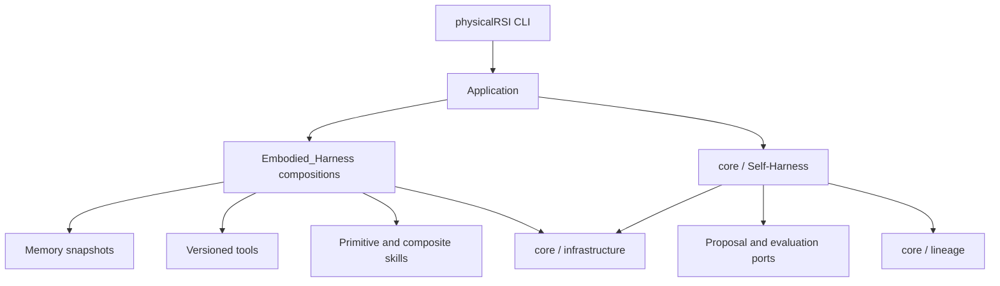

# Architecture

## Ownership and composition

`PhysicalRSI/Embodied_Harness` is the shared capability domain for Memory, Tool, and Skill. These capabilities can call one another and can be composed through explicit contracts. `PhysicalRSI_core` owns the single Self-Harness loop and the infrastructure layer; it does not import the capability domain, the CLI, or a baseline implementation. The application injects proposal, evaluation, selection, and capability components.

Every capability exposes an `Operation` with an explicit name, revision, input, output, call, and effect set. `Contract` records semantic type, units, coordinate frame, and embodiment. Serial composition requires exact adjacent contracts; conversions must be explicit tools. Parallel branches receive independent input copies, must have disjoint effects, and return an ordered tuple for an explicit join.

Memory snapshots are content-addressed and verified on read. Creating a snapshot does not replace the active capability set or grant qualification. A changed dependency requires a new revision and a new composition.

## Self-Harness and lineage

The bounded Self-Harness loop is: development feedback, proposal, admission, frozen comparison pool, fresh validation input, paired evaluation, selection, and compare-and-swap inheritance. Memory, Skill, and Tool changes are evaluated as one dependency-closed candidate. Digests, raw evidence, budgets, comparison identity, failures, and rejection reasons are persisted.

The preview labels these two timescales explicitly. **System 1** is the runtime
loop: it reads the current observation, task skill_choice, and immutable memory snapshot,
then executes one of the bound skills and records the episode state. **System 2**
is the development loop: it consumes development evidence, proposes skill or
memory changes, admits candidates, evaluates them on fresh inputs, selects a
survivor, and commits lineage. System 2 may change what System 1 will execute;
it is not invoked for every action step. The distinction is a functional
boundary, not a claim that two separate neural networks are always required.

The Robodojo baseline exposes three core skill roles. `pi05` is a provider-backed
policy skill, `pi05-sparse-memory` is the provider-backed policy skill with causal
visual history, and `code-policy` is the exploration skill produced from paired
development evidence. Task skill_selection selects one of these roles and binds it to an
immutable exploration-memory revision. The CPU-only
`PhysicalRSI_demos.skill_memory` catalog demonstrates this relationship without
claiming model inference or physical qualification.

Lineage checks versions and evidence, detects concurrent parent changes, and records rollback as a new history version. Completed stages can resume; an external stage that started without a confirmed completion requires reconciliation before another attempt.

## Infrastructure

The infrastructure layer provides atomic storage, POSIX locking, bounded execution, resource pools, managed process groups, service startup and cleanup, RPC transports, request journals, execution events, trajectories, and optional dataset export. It records action identity, capability version, inputs, outputs, duration, failures, and post-action observations. `DeviceRegistry` adds durable exclusive device claims across cooperating processes on one controller host; `ResourcePool` remains the in-process capacity allocator. Local cancellation is cooperative; distributed scheduling, dynamic batching, and cross-process GPU capacity allocation are outside this preview.

## User-facing paths

The product has two workflows: demo and baseline. `/demo` loads the local Memory → Tool → Skill example, which `/run` executes. `/task` loads a task package; `/baseline` runs the shared preflight check and then invokes the task's baseline once. Both workflows use the same `Application` command table and execution layer. Configuration and inspection commands support these workflows. An optional model turns natural-language requests into bounded tool calls; model conversation is not capability state or version truth.

Task packages use `physicalrsi.task/v1` and provide a factory with `check`, `run`, `evolve`, and `status` operations. Baseline execution reads the committed capability version and reports scope and qualification explicitly. The interface does not infer physical success from the existence of an adapter.

The RoboDojo package is an optional baseline adapter. Its workflow provides task-specific proposal and evaluation logic while inheritance remains in core Self-Harness. Native perception, planning, isolation, and independent scoring still require validation in the target RoboDojo environment.

## Physical experiment boundary

`PhysicalRSI_core/experiments.py` adds a task-independent reset, action, observation and verification runtime. It freezes the case, budget and adapter identities and records raw evidence before returning a verdict. Success, task failure, uncertainty, invalid setup and interrupted execution remain distinct. Declared embodiments bind exact observation/action contracts to System 1, initialize policy state per episode, and require shared device ownership for physical execution. System 2 trial provenance binds a candidate to its comparison and cohort without participating in the action loop.

`self_harness/evaluation.py` adapts those experiments into development feedback and paired validation without changing the selection algorithm. `infra/trial_quota.py` admits whole trial plans before effects, and `self_harness/campaign.py` runs bounded iterations of the same Self-Harness with retained-round audit and lineage checkpoint recovery. System 2 changes the next committed System 1 revision between trials; device reset, action dispatch and quiescence stay inside the experiment/controller boundary. See [System 2 campaigns](system2-campaigns.md) for native simulation evidence and recovery limits.

`self_harness/proposals.py` supplies a reusable System 2 edit boundary for JSON configuration. Reviewed enumeration and the external model adapter submit the same parent-bound edits against a task-declared schema. The request exposes verified development summaries and editable values; candidate materialization retains the fixed foundation and requires the existing suite admission. `infra/proposal_model.py` bounds one tool-free model call in an owned process and preserves provider-reported usage without treating it as performance. Durable replies can resume materialization; unknown calls are not replayed. See [structured proposals](system2-proposals.md) for tested scope and provider limitations.

`infra/actuation.py` moves the final generation check and finite command execution into an independently running device backend. `ActuationDriver` keeps this behind the existing controller port, while the device process inhibits expired output and separately measures settling before handoff. The [actuation guide](actuation-watchdog.md) distinguishes controller-process-death evidence from a hardware watchdog surviving device-host failure. System 2 does not renew these leases or change stop behavior inside an executing System 1 episode.

`infra/operator.py` supplies an optional local recovery endpoint authenticated by the service's OS identity. The dedicated `./physicalrsi operator` CLI saves an inspection, prepares a generation-bound request and resolves durable status without automatically repeating unknown effects. Controller stops retain their original driver thread. Recovery is separate from System 1 execution and System 2 proposal/evaluation, and never changes an interrupted trial's outcome. See [operator recovery](operator-recovery.md) for deployment isolation requirements and native recovery evidence.

`infra/clock_sync.py` supplies optional bounded conversion between controller and actuator clock domains. Clock exchanges preserve uncertainty and declared drift assumptions; command deadlines use the conservative offset bound, while observation freshness uses the earliest possible source capture. Mapped deadlines and source intervals remain attributable in actuator receipts and experiment trajectories. The conversion policy is part of the frozen driver identity used by System 2 comparisons. See [clock domains](clock-domains.md) for software/native evidence and the remaining physical clock and network qualification.

The two control hops can independently require mutual TLS through `infra/rpc/tls.py` and `infra/rpc/authenticated_http.py`. CA validation and certificate fingerprints identify peers; exact method grants constrain their RPC access before dispatch. Ownership generations and command deadlines still govern admitted effects. Authorization records contain public certificate and policy fingerprints, with no credential fields or raw payloads. System 2 proposal workers should receive neither control certificates nor raw device access; this separation requires deployment isolation. [Control transport security](control-transport-security.md) covers configuration, bounded transport behavior and the optional native fault fixture. Operator recovery stays on its separate local interface.

The `self_harness.experiments` bridge converts verified trials into paired evaluation results, keeping execution and scoring conditions fixed across candidates. The existing Self-Harness continues to own admission, fresh validation, survivor selection and inheritance. See [core](../PhysicalRSI_core/README.md) and the [embodied runtime guide](embodied-runtime.md).

The optional `infra/isolated_policy.py` and `infra/isolated_proposal.py` adapters run stdlib-only candidate source in restricted Linux processes. System 1 receives public episode data and returns actions; System 2 receives development summaries and returns proposals. The trusted host retains device credentials, action admission, independent verification and lineage. Policy process teardown joins the experiment evidence through `policy.json`; it does not substitute for measured device quiescence. See [isolated candidates](isolated-candidates.md) for the OS trust assumptions and supported profile.

System 1 can produce bounded action chunks through `ControllerGateway`. The gateway checks the referenced observation in the controller's monotonic clock, records dispatch intent, and calls the driver only while the observation is fresh. `ControllerHost` serializes device operations on one thread and keeps status queries available during execution. Each driver owns control ticks, sensor-clock mapping, cancellation and stop behavior. This separates policy inference from the servo loop without claiming hard real-time behavior from Python. The [controller gateway guide](controller-gateway.md) describes the wire boundary and simulator evidence.

The gateway's `ControlAuthority` owns command admission independently of a client's filesystem locks. A claim binds one frozen System 1, authority ID and ownership generation; lease expiry and revocation block new dispatch without asserting a stop. Renewal/revocation remain available outside the driver queue, while `Context.check()` propagates ownership loss into cooperative drivers. Transfer requires verified quiescence. This supports multiple clients of one authoritative endpoint; backend fencing between independent gateways and physical watchdog behavior remain separate robot integration requirements. See [controller ownership and recovery](controller-ownership.md).
