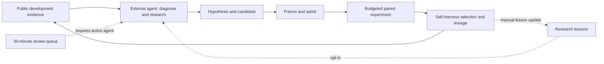

# Current autoresearch pipeline and integration priorities

Audited on 2026-10-08. The initial audit and priorities are below. The first
increment now implements [durable research records](autoresearch-records.md)
with parent/memory binding, revision checks, experiment/result tracking, and
heartbeat linkage. Automated dispatch and benchmark-wide adoption remain pending.

## What actually runs

There are three cooperating paths, with an external coding agent connecting
them. They do not yet form one unattended, benchmark-independent research loop.

| Path | Implemented behavior | Boundary |
| --- | --- | --- |
| `PhysicalRSI_Autoresearch/study.py` and `run.py` | Frozen liquid-handling proposal batch, simulator plus independent audit, bounded trials, resumable keep/discard/error ledger, final validation and immutable memory artifact | The proposal domain and evaluator are liquid-handling specific. It does not read literature, propose the next batch, or reuse its final memory to generate proposals. |
| External agent and benchmark launchers | Inspect public development traces, investigate failures, search literature, edit candidates, prepare source manifests, launch and audit benchmark experiments | The research decisions and much of the orchestration depend on the active agent. Versioned runtime scripts are not a generic scheduler. |
| Self-Harness | Freeze and admit candidates, execute paired comparisons, retain or inherit a revision, preserve evidence and lineage, enforce configured budgets | `ImprovementCampaign` explicitly has no autonomous proposer or scheduler. A configured proposer can use enumerated edits; its presence alone does not establish model-generated research. |
| `heartbeat.py` | Queue an overdue review every 30 minutes; require evidence, reflection, alternatives, decision and next experiment before completion | A timer event does not launch an agent. The new record adapter can bind the next action to a specific research revision; legacy callers still submit prose. |
| `records.py` | Persist a hypothesis, selected parent, memory, budget, dispatch claim, result and disposition; inspect explicit workspace indexes | First integration is a LIBERO record at the preparation stage. Actual launchers must opt in and enforce budgets and admission. |
| `research_memory.py` | Immutable scoped lessons, suspension after counterexamples, refinement, candidate-bound admission checks | Opt-in. Existing benchmark campaigns do not automatically consume these lessons. Contract tests and retrospective reconstruction do not measure memory benefit. |

Policy memory and research memory have different roles. Existing policy memory
can be part of a frozen candidate and participate in paired selection. The new
research memory is intended to guide System 2: what to try, which conditions
apply, what has been contradicted, and what must be checked first. Neither
should silently rewrite the other or expose evaluator-only information to
System 1.

## Gaps that currently cost research time

1. **Review-to-experiment follow-through was not enforced.** A legacy completed
   heartbeat can name an experiment without registering it or recording why it
   was superseded. The new record adapter addresses tracking and revision
   binding; default adoption by all launchers is still required.
2. **Memory is not on the default research path.** The new API preserves and
   checks lessons, but callers can bypass it. We do not routinely record which
   lessons were delivered, consulted, or tested by each proposal.
3. **Cheap mechanism checks are not universal prerequisites.** Calling a
   capability is distinct from activating its backend; planning on retained
   snapshots is distinct from successful native execution. These distinctions
   have required separate diagnostic scripts.
4. **Research decisions are scattered across run-specific artifacts.** Runtime
   tools and preflight directories include thousands of historical files. This
   count measures accumulated artifacts, not code quality, but reinforces the
   need for an explicit current research index rather than directory guessing.
5. **Resource use is not research value.** Per-job leases, watchdogs, budgets and
   GPU telemetry exist. They do not by themselves choose the next useful
   experiment, eliminate repeated failures or attribute waiting time to its
   source. More GPU occupancy is not evidence of more informative experiments.

## Priority 1: connect existing contracts with one research record

Introduce a versioned research record that binds a hypothesis to its actual
selected parent, evaluator identity, pinned research-memory revision, candidate,
case protocol and budget. Reuse existing harness freezing, `MemoryBoundSuite`,
`CaseProtocol`, quota and lineage APIs; do not create another competing selector.

The record should also name a falsifier, alternatives, applicable lessons,
required checks, stopping conditions and the result artifact expected from each
stage. A heartbeat's next action should reference this record or explicitly
record a deferred/superseded action. Completion should mean a recorded decision
and lesson disposition, including "no supported lesson," rather than a process
exit or a prose statement that more experiments are needed.

Acceptance: after restarting the agent, one current index resolves the exact
parent, pending research action, job identity and evidence; a stale parent or
missing memory binding fails before any native rollout. No changes to a live
experiment's frozen sources are needed.

## Priority 2: progressively spend evidence and execution budgets

Use a declared sequence with stage-specific exit criteria:

1. Static and CPU checks: source identity, API/schema validity, applicable
   lessons, counterexamples, and exact recorded public-callback replay.
2. Mechanism checks: confirm actual detector/planner/primitive activation and
   the expected intermediate observation. Reject an inactive intervention.
3. Small native development pilot: compare against the verified selected parent,
   preserving failed resets and timeouts, before allocating a larger cohort.
4. Preregistered fresh paired confirmation: include previous successes and
   changed conditions with the same evaluator and budget for both arms.
5. Freeze the survivor and run report-only final validation/test. Do not use
   these outcomes to revise the same study's memory or select another survivor.

Each stage is a separate claim. A failed or inconclusive stage may lead to a new
hypothesis, but must not be silently relabeled as a successful earlier stage.
Repeated peeking must not alter a fixed statistical selection rule. Budget
reallocation happens between frozen studies, not by changing a running cohort.

Acceptance: a candidate whose fallback backend never executes cannot consume
the large-cohort budget; a planning-only result cannot become a native success.

## Priority 3: make negative evidence change the next proposal

Record failure signatures using public observations and reviewed diagnostics,
not hidden task identities. Match lessons by declared applicability before any
semantic ranking. Record retrieved and used lesson IDs separately: delivery is
not use. A proposal must state what changed since a rejected hypothesis or
which competing explanation it discriminates.

Predeclare a stall rule for each study. For example, after two completed pilots
fail to activate the intended mechanism, suspend that route and compare a
different failure explanation with a cheap discriminating test. This example
is an engineering policy to test, not a validated universal threshold. Failed
infrastructure jobs require reconciliation; they are not mechanism failures.

Acceptance: a retained counterexample reappears as a mandatory check, and a
repeated proposal with no changed condition or new discriminating evidence is
identified before launch. Compare frozen versus evolving memory at equal
proposal/context budgets as specified in [the memory study](research-memory-evolution.md).

## Priority 4: schedule by completed useful experiments

Separate CPU replay, perception service, planning and native-rollout queues so
independent preparation can proceed while a GPU stage runs. Use existing device
ownership and watchdogs, current process checks and quota identity. New instances
in simulation and agent partitions remain prohibited by `AGENTS.md`; other
partitions require verified eligible spare capacity, released after use.

Measure proposal-to-admission time, queue time, stage execution time, repeated
failure rate, completed paired cases, cost per confirmed improvement, and
percentage of research actions reaching a decision. Report GPU utilization as
an infrastructure diagnostic. Do not count incomplete, rejected or failed work
as free when comparing research strategies.

## First concrete integration target

Use the LIBERO held-object component-cover investigation as the first research
record. The retained-snapshot planning study established three feasible paths;
it did not establish fresh-layout or native execution improvement. Bind the
verified selected parent and the refined development-memory revision, retain
ambiguous-component and previous-success checks, and freeze a candidate and
case protocol before a small paired native pilot.

Keep the perception backend fixed when measuring memory effects. Changing
memory, primitive code and perception together can evaluate the combined system,
but cannot establish which change caused the improvement.

The first increment adds the durable record and its heartbeat adapter, with a
real LIBERO hypothesis registered for preparation. The remaining mechanisms
above are still integration priorities, not deployed autonomous behavior.
