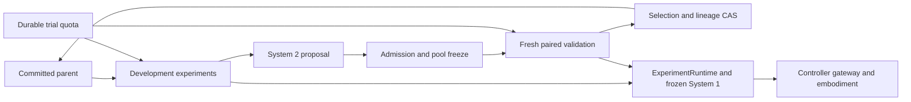

# Bounded System 2 campaigns

`ExperimentEvaluator` connects development trials and paired validation to the existing Self-Harness selection and lineage path. `ImprovementCampaign` runs a declared number of those iterations with one committed parent at a time. The same evaluator boundary accepts different System 1 implementations and embodiment adapters.

The infrastructure review follows OpenRSI's [pinned run guide](https://github.com/FrontisAI/OpenRSI/blob/71ae803a035d5e3b78c19fa49ed9f67d0550cbaa/OpenMLE-Evo/docs/usage.md): explicit attempt identity, bounded work, strict recovery and one writer for committed state are useful patterns. The physicalRSI implementation adds durable trial admission and preserves uncertain physical effects instead of turning an interrupted attempt into an automatic retry. No upstream implementation is imported by these modules.

## Responsibilities

| Component | Responsibility |
| --- | --- |
| System 1 | Run one frozen harness revision, read observations and propose actions using its declared skills, tools and memory |
| System 2 proposer | Inspect development evidence and materialize dependency-closed candidates between trials |
| `ExperimentSuite` | Declare task sampling, candidate admission, environment/policy construction and independent verification |
| `ExperimentEvaluator` | Freeze case plans, reserve trials, invoke the experiment runtime and bind definite validation outcomes to the comparison |
| `TrialQuota` | Admit complete plans atomically across cooperating local processes; preserve reservations across restart |
| `SelfHarness` | Freeze the candidate pool, enforce paired selection and commit the survivor through lineage CAS |
| `ImprovementCampaign` | Bound the number of rounds, audit completed rounds and continue from the selected parent |

A reasoning model used to choose actions during an episode is System 1. A scripted repair rule can be System 2. Model size or reasoning speed does not decide the role. Replacing the proposer does not require replacing the device driver, and replacing System 1 does not give it authority to change the evaluator or its validation cases.



## Run the native simulation campaign

Use an environment with the optional MuJoCo dependency:

```bash
pip install -e '.[mujoco]'
study_dir="$(mktemp -d /tmp/physicalrsi-mujoco-evolution.XXXXXX)"
python -m PhysicalRSI_demos.mujoco_evolution \
  --workspace "$study_dir" --rounds 2 --trials 12

# Audit the same completed campaign without another reset or action.
python -m PhysicalRSI_demos.mujoco_evolution \
  --workspace "$study_dir" --rounds 2 --trials 12
```

The demo owns two localhost controller processes using native MuJoCo dynamics. Slider observations/actions use meters and newtons; hinge observations/actions use radians and newton meters. Both use the [same controller gateway](controller-gateway.md) and experiment runtime.

The initial System 1 uses zero effort. Development executes one case per fixture. On measured failure, the deterministic proposer enables the existing reviewed proportional/derivative feedback skill in a separately materialized candidate. It pins local source hashes, simulator model hashes and the installed MuJoCo version, preserves the foundation component, and records zero training steps. It does not generate a new control algorithm or train a model.

After both harnesses pass admission and the pool is frozen, the suite samples two validation cases per fixture. Initial positions and positive/negative targets vary; adding a random identifier to an otherwise identical case would not establish a new test condition. Case digests must differ from development and from other committed comparisons. These small sampled cases exercise the integration; they are not statistical evidence of transfer to other tasks or robots.

The first round reserves two development and eight validation trials. Independent verification compares measured final position and velocity with the declared target and tolerances. A candidate must improve the aggregate score without exceeding either fixture's regression allowance. A successful selection writes an actual lineage revision. The second round executes two development trials with the selected controller and retains it when the proposer has no changed candidate.

The report includes `status`, `completed_rounds`, per-round parent/result revisions, selection metrics and quota totals. `lineage_committed: true` means an inherited revision is present; `qualification: null` and the simulation scope remain explicit. `budget_exhausted` is a separate stopping condition, not successful completion of all requested rounds.

```text
workspace/
  seed/                         initial immutable harness components
  state/                        current pointer, history and validation registry
  quota/reservations.json       shared mutable reservation ledger
  controllers/                  device state and request journals
  services/                     local process lifecycle
  campaign/
    campaign.json               configuration and audited round records
    rounds/round-0001/
      develop.json              completed development-stage receipt
      propose.json              materialized child and provenance
      validation-cases.json     actual frozen cases
      validation-cohort.json    paired case identities
      experiments/
        development/<id>/       immutable plan, quota receipt and trials
        validation/<id>/        immutable plan, quota receipt and trials
      selection.json            independently recomputable decision
      commit.json               committed lineage result
    rounds/round-0002/           evidence for a retained or inherited next round
  result.json                   compact simulation report
```

## Budget semantics

Self-Harness validates task weights, cohort sizes, score ranges and selection thresholds before creating a round workspace or calling any port. Direct evaluator validation and recovery calls independently validate the frozen comparison, including its candidate pool, scope and task coverage, before sampling cases or reserving trials. The same profile validator is used by survivor selection; invalid scoring configuration cannot defer rejection until after device trials.

`TrialQuota(root, max_trials=N)` charges distinct planned trials. Reservation IDs bind a durable experiment destination and the frozen plan. Repeating identical reservations costs nothing; changing inputs under an existing ID fails. A whole candidate pool is reserved before its first validation trial, so an insufficient allowance cannot spend the remaining trials on only the incumbent. Concurrent processes cannot partially admit a plan or overdraw the ledger.

Reservations count admission, not completed execution. Unstarted, failed, interrupted and uncertain trials keep their reservation. There is no automatic refund or TTL. Each experiment also retains its own `Budget(max_steps, seconds)`: steps count policy decisions, which may emit bounded chunks. Neither reservation count nor decision count claims a fixed number of physical control ticks.

Campaign round limits and trial allowances are frozen. These are not GPU/token accounting or a whole-campaign wall-clock deadline. The optional [structured proposer](system2-proposals.md) separately limits model-call time, payload size and one call per round, and records provider-reported usage. Other proposal implementations must bound their own computation. Start a separately declared study when changing budgets, protocols or code; do not edit existing ledgers.

## Recovery and evidence

Completed Self-Harness stages keep their saved outputs and input hashes. Unfinished stages block by default. Explicit `resume_development`, `resume_proposal`, `resume_validation` and `resume_evaluation` port methods can recover only work whose finer-grained receipts make continuation possible. The structured proposer resumes from a durable response and blocks unknown calls; legacy proposers without that hook and unfinished admission stages still require reconciliation.

The included evaluator preserves frozen plans and case files. Before executing a missing trial in a candidate's plan, it reads all existing receipts in that plan. Completed trials are verified and reused. A started trial or a receipt requiring reconciliation blocks continuation; a disconnect after an action cannot become a zero score or trigger another reset. Validation accepts only definite success/failure outcomes with complete paired coverage. Development exposes the original outcome labels to the proposer.

A completed validation trial with an `uncertain` or `invalid` outcome stops evaluation before another trial starts. Recovery checks these completed outcomes before executing missing trials as well, including when the evaluator was interrupted immediately after a receipt was saved. The original completed receipt remains intact; the evaluator does not relabel it as a failed task, rerun it, refund reservations or commit a survivor. Investigate the evidence and use a separately declared comparison for any changed setup. Development may still return these outcome labels as feedback for System 2.

Validation also checks each score against the frozen comparison before continuing. An explicitly named measurement must be present, numeric (not a boolean), finite and inside that task's declared score range. Binary success scores use the same range check. The evaluator and final result builder share this rule. An invalid measurement blocks missing trials on recovery, preserves the original receipt and reservations, and cannot be replaced with an inferred score. Development feedback remains unscored.

The campaign audits every completed round's files and historical lineage before proceeding. This includes retained rounds, which do not add a lineage node. `HarnessState.read(revision)` verifies a historical record without moving the current pointer. A crash after lineage CAS but before either the iteration or campaign checkpoint can recover only when the pending round's exact selection evidence explains the new current revision. An unrelated concurrent lineage change is rejected.

Keep the mutable quota, device registry and service journals outside immutable round evidence directories. Storage requires a filesystem with working POSIX locks and atomic durable writes. The device registry records local experiment ownership; the [controller authority](controller-ownership.md) additionally checks control claims from all clients of one gateway. The optional [actuation backend](actuation-watchdog.md) adds shared device generations and an independent software watchdog. Optional [clock conversion](clock-domains.md) freezes a declared uncertainty policy and preserves mapped timing evidence. Hardware watchdogs, SDK exclusivity, actual multi-host/sensor clock qualification, sensor accuracy, real-time scheduling, physical qualification and broad autonomous proposal strategies remain integration work.

## Adapter entry points and checks

A suite implements `identity`, `admit`, `development_cases`, `validation_cases`, `environment`, `policy` and `verifier`. Identity must cover sampling, scoring, controller/model sources and provider revisions. Sampling, admission and adapter constructors must not reset or actuate a device. The policy must expose the SHA256 of the full candidate manifest as `System1.revision`; it should retain the underlying model/skill revisions as dependencies. See `JointSuite` and `HarnessJointPolicy` in `PhysicalRSI_demos/mujoco_evolution.py` for a complete adapter.

```bash
python -m pytest -q tests/test_trial_quota.py tests/test_improvement_campaign.py
python -m pytest -q tests/test_mujoco_evolution.py
```

The first command checks process contention, budget exhaustion, interrupted evaluation, unknown effects, lineage checkpoint failures, retained-round audit and fresh-case exclusion using CPU software fixtures. The second requires MuJoCo and verifies measured improvement through both controller processes, actual inheritance, a subsequent retained round, candidate attribution and no additional controller requests on replay. A skipped MuJoCo test is not simulator evidence.
